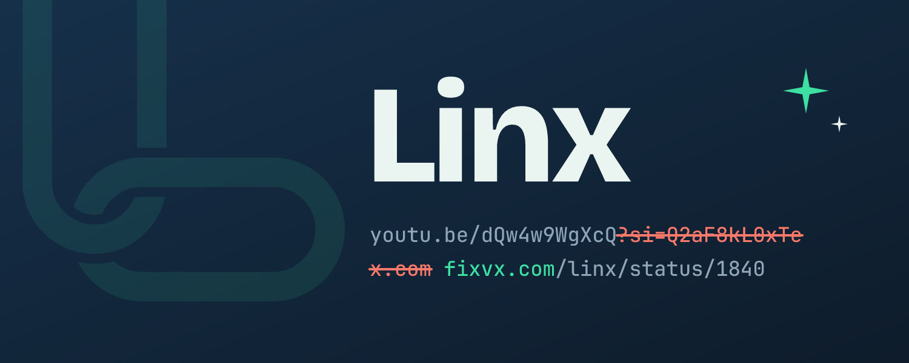

# Linx



Linx is a Discord bot that watches messages for links, strips tracking parameters (`utm_*`, `fbclid`, `si`, `?s=20&t=...`, etc.), and rewrites `x.com` / `twitter.com` links to `fixvx.com` so they embed properly.

When a message has a link that can be cleaned, the bot replies with the cleaned version and (optionally) hides the original message's embed. There's also a `/clean <link>` slash command.

## What gets cleaned

Linx only replies when the cleaned link is different from the original. Unknown parameters are always kept, so pagination, search terms and product variants keep working. The full lists live in `cleaner.py`.

**Removed from every link** (about 150 names, plus anything starting with `utm_`, `pk_`, `mtm_`, `piwik_`, `matomo_`, `hsa_`, `vero_` or `oly_`)

| Kind | Examples |
|---|---|
| Ad click IDs | `fbclid`, `gclid`, `gbraid`, `wbraid`, `gad_source`, `gad_campaignid`, `msclkid`, `ttclid`, `twclid`, `li_fat_id`, `yclid`, `ysclid`, `ScCid`, `epik`, `srsltid` |
| Analytics | Google `_ga`, `_gl`; Adobe `s_cid`, `s_kwcid`, `ef_id`, `sc_*`; AT Internet `at_*`, `xtor`; comScore `ns_*`; Webtrends `WT.mc_id` |
| Social shares | `igshid`, `igsh`, `ig_rid`, `fb_action_ids`, `fb_ref`, `fb_source`, `ref_src`, `ref_url`, `rdt_cid` |
| Email and marketing | Mailchimp `mc_cid`, `mc_eid`; HubSpot `_hsenc`, `_hsmi`, `__hstc`, `__hssc`, `__hsfp`; Marketo `mkt_tok`; Klaviyo `_kx`; Eloqua `elq*` |
| Affiliate networks | Impact `irclickid`, CJ `cjevent`, ShareASale `sscid`, Awin `awc`, Rakuten `ranMID`, `ranEAID`, `ranSiteID`, PartnerStack `ps_xid` |
| Article widgets | Outbrain `obOrigUrl`, `ob_click_id`; Taboola `tblci`, `dicbo` |
| Other | Shopify `_pos`, `_sid`, `_ss`, `_psq`; Yahoo `guccounter`, `guce_referrer`; `cmpid`, `ito`, `referrer` |

`ref` is deliberately **not** removed everywhere, because sites like GitHub use it for real things (`?ref=branch`).

**Removed only on specific sites** (these names can mean something real elsewhere; subdomains and country domains are included)

| Site | Removed |
|---|---|
| X / Twitter | `s`, `t`, `cxt`, `rw_tt_thread` |
| YouTube and youtu.be | `si`, `is`, `feature`, `pp`, `ab_channel`, `kw`, `source_ve_path`, `embeds_referring_euri`, `embeds_referring_origin` |
| Spotify | `si`, `nd`, `context`, `_branch_match_id`, `_branch_referrer` |
| Instagram | `igsh`, `img_index` |
| TikTok | `_r`, `_d`, `_t`, `u_code`, `user_id`, `timestamp`, `share_app_id`, `share_item_id`, `share_link_id`, `sender_device`, `sender_web_id`, `web_id`, `is_from_webapp`, `social_share_type`, `sec_user_id`, `checksum`, `tt_from`, `tt_medium`, `source`, `refer` |
| Reddit | `share_id`, `share_source`, `share_recommendation`, `correlation_id`, `rdt`, `ref_source`, `ref_campaign`, `chainedPosts`, `post_fullname` |
| Facebook | `mibextid`, `__cft__`, `__tn__`, `__xts__`, `rdid`, `sfnsn`, `extid`, `ref`, `fref`, `hc_ref`, `hc_location`, `paipv`, `eav`, `acontext`, `notif_id`, `notif_t`, `comment_tracking`, `xts` |
| LinkedIn | `trk`, `trkInfo`, `trackingId`, `lipi`, `rcm`, `refId`, `eBP`, `otpToken`, `original_referer`, `licu`, `originalSubdomain`, `midToken`, `midSig` |
| Pinterest | `invite_code`, `sender`, `sfo` |
| Bing | `cvid`, `form` |
| Google search | `ei`, `ved`, `oq`, `gs_lp`, `gs_lcrp`, `sca_esv`, `sxsrf`, `sclient`, `client`, `source`, `rlz`, `cd`, `cad`, `rct`, and other search-page noise. `q`, `tbm`, `udm`, `tbs`, `start` and `hl` are kept. |
| Amazon | `tag`, `ref`, `ref_`, `psc`, `th`, `linkCode`, `linkId`, `creative`, `creativeASIN`, `camp`, `ascsubtag`, `keywords`, `qid`, `sr`, `crid`, `sprefix`, `dib`, `dib_tag`, `content-id`, `_encoding`, `pd_rd_*`, `pf_rd_*`, `social_share`, `starsleft`, `ie`, `rsd`, `edk`. Product links keep only `smid` (the seller); everything else is dropped. |
| AliExpress / Temu | `spm`, `scm`, `pvid`, `algo_pvid`, `algo_exp_id`, `aff_*`, `terminal_id`, `sk`, `btsid`, `ws_ab_test`, `pdp_npi`, `curPageLogUid`, `_t`, `_x_ads_channel`, `_x_sessn_id`, `refer_page_name`, `refer_page_id`, `srcSp`, `top_gallery_url` |
| eBay | `_trkparms`, `_trksid`, `mkcid`, `mkrid`, `mkevt`, `campid`, `customid`, `toolid`, `siteid`, `amdata`, `norover`, `ssspo`, `sssrc`, `ssuid`, `widget_ver` |
| Etsy | `click_key`, `click_sum`, `frs`, `sc_g`, `organic_search_click`, `ga_order`, `ga_search_type`, `ga_view_type` |
| Walmart | `athbdg`, `athcpid`, `athena`, `athpgid`, `athznid`, `from`, `sid`, `veh`, `adsRedirect` |
| Best Buy | `intl`, `loc`, `acampID` |
| Shopify | `_v` |
| Google Play | everything except `id`, `hl` and `gl` |

**Other fixes**

- **X / Twitter embeds:** `x.com` and `twitter.com` links (including `www.`, `m.` and `mobile.`) are rewritten to `fixvx.com`. Turn off with `FIX_X_LINKS=false`.
- **Product links reduced to the product ID:** Amazon `/dp/<ASIN>` (plus `smid` if present), Best Buy `/site/<sku>.p`, Walmart `/ip/<id>`. Other Amazon pages lose their `/ref=...` path segment.
- **Tracking after the `#`** (e.g. `#utm_source=...`) is removed. Page anchors, app routes (`#/inbox`) and text highlights (`#:~:text=`) are left alone.
- **Redirect wrappers** are unwrapped to the real destination, including nested and double-encoded ones:
  - Google `google.com/url?q=` and AMP pages (`google.com/amp/s/...`)
  - YouTube `/redirect` (links in video descriptions)
  - Facebook `l.facebook.com`, `lm.facebook.com`, `l.messenger.com`, `l.instagram.com`
  - Outlook Safe Links, Steam's link filter, `out.reddit.com`, Tumblr `t.umblr.com`, Medium `/r/`, LinkedIn `/redir/redirect`, XING, Slack, VK, Pocket, DeviantArt and `href.li`
- **Short links** are expanded and then cleaned. Linx reads only the redirect from the shortener and never loads the destination page. If a short code is dead and lands on a homepage, the link is left alone. Turn off with `EXPAND_SHORT_LINKS=false`.
  - Site shorteners: `amzn.to`, `a.co`, `amzn.eu`, `amzn.asia`, `vm.tiktok.com`, `vt.tiktok.com`, `tiktok.com/t/...`, Reddit `/r/<sub>/s/...`, `spotify.link`, `spoti.fi`, `pin.it`, `apple.co`, `fb.me`
  - General shorteners: `bit.ly`, `j.mp`, `t.co`, `tinyurl.com`, `ow.ly`, `buff.ly`, `rb.gy`, `cutt.ly`, `is.gd`, `v.gd`, `rebrand.ly`, `tiny.cc`, `shorturl.at`, `s.id`, `dlvr.it`, `trib.al`, `bl.ink`, `smarturl.it`. These always get a reply showing where they really go.

## Setup

1. Create an application named **Linx** at https://discord.com/developers/applications.
2. On its **Bot** page, click **Reset Token** and copy the token, then enable **Message Content Intent** and save.
3. Double-click **`start.bat`**. On first run it installs everything and asks you to paste the token (saved to `.env`).
4. Open the invite link Linx prints in the window to add it to your server.

Keep the window open while you want the bot online. If the token is wrong, Linx clears it and asks again next run.

## Reply and reaction notifications

When Linx posts a cleaned link for someone, replies and reactions to it go to Linx instead of that person, so Linx forwards them by DM. This covers links someone ran `/clean` on and Linx's automatic replies to links people posted (notifications go to the person who posted the link):

- **Replies** are sent right away, with the reply text and a link to it.
- **Reactions** are bundled. After the first reaction, Linx waits 30 seconds and sends every reaction from that window in one DM. A reaction after that starts a new bundle.

Each person controls their own notifications with `/notifications`. It shows current settings when run with no options.

- `/notifications replies:False` or `reactions:False` turns either one off. Set both to `False` to turn notifications off completely.
- `/notifications bundle_seconds:120` changes the reaction window (0 to 3600 seconds; 0 sends each reaction right away).

Settings are stored in `data/linx.db` (or `$LINX_DATA_DIR/linx.db`). People who block DMs from server members won't get notifications.

## Running with Docker

For an always-on server, build the image and pass settings through an env file (see `.env.example`):

```sh
docker build -t linx .
docker run -d --name linx --restart unless-stopped --env-file .env -v linx-data:/data linx
```

`docker logs linx` shows the invite link. The token must be set in `.env`, since the container can't prompt for it.

## Tests

```powershell
.venv\Scripts\python -m unittest
```

With Docker (runs as your user so the tests can read `.env`):

```sh
docker run --rm --user "$(id -u):$(id -g)" -v "$PWD":/src -w /src linx python -m unittest
```

## Customizing

Tracking parameter lists live at the top of `cleaner.py`: `GLOBAL_TRACKING_PARAMS` and `GLOBAL_TRACKING_PREFIXES` apply everywhere, `SITE_RULES` only on specific sites (e.g. `si` is tracking on YouTube/Spotify but may be meaningful elsewhere), and `UNWRAPPERS` lists the redirect wrappers. Supported short-link services are listed in `shortlinks.py`. Only those hosts are ever contacted.

## Branding

`branding/` holds the avatar (`logo.png`, 1024×1024) and profile banner (`banner.png`, 1500×600), with SVG sources and `generate.py` to regenerate them.
